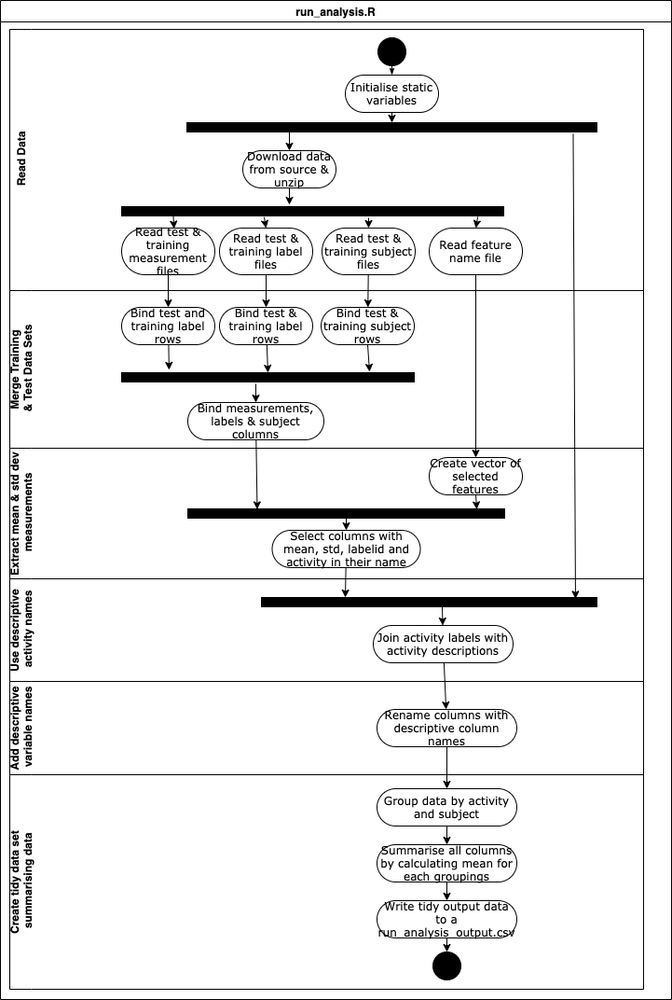

## Codebook For The Tidy Data Set 
**Getting & Cleaning Data Course Project: Tidying Up UCI HAR Data Set**

### Introduction

This document is the code book for the tidy data set created from UCI Human Activity Recognition smartphone data. This document hat modifies and builds on available codebooks available with the source. Specifically it,

* Identifies all the variables and summaries present in the output data set, along with units and  other relevant information
* Outlines rationale behind selection of the variables satisfying both functional requirements and tidy data principles
* Explains provenance of source data used to construct the data set and 
* Explains the logic applied to transform the data between its source and target formats. 

This document should be read in conjunction with the following files:

* run_analysis_output.txt, that is a file with data described in this document, 
* run_analysis.R, which includes the R script used to generate the tidy data set,and
* general information on source data available at https://archive.ics.uci.edu/ml/datasets/human+activity+recognition+using+smartphones
* feature_info.text available with source data describing features used in the source data.

### Data Source
Data used to produce the output data set has been sourced from https://d396qusza40orc.cloudfront.net/getdata%2Fprojectfiles%2FUCI%20HAR%20Dataset.zip

The following files have been used as an input into production of the output data set:

| **File name**                             | **Description**                   |
| ----------------------------------------- | --------------------------------- |
| UCI HAR Data Set/test/X\_test.txt         | Test data set measurements        |
| UCI HAR Data Set/train/X\_train.txt       | Training data set measurements    |
| UCI HAR Data Set/test/y\_test.txt         | Test data set activity labels     |
| UCI HAR Data Set/train/y\_train.txt       | Training data set activity labels |
| UCI HAR Data Set/test/subject\_test.txt   | Test data set subjects            |
| UCI HAR Data Set/train/subject\_train.txt | Training data set subjects        |
| UCI HAR Data Set/features.txt             | Feature names                     |

### Variable Information
Variables present in the output tidy data set are as follows:

| **Variable Name**                          | **Domain** | **Variable Description**                                                                                                 | **Data Type** | **Allowed Values**                                                                  |
| ------------------------------------------ | ---------- | ------------------------------------------------------------------------------------------------------------------------ | ------------- | ----------------------------------------------------------------------------------- |
| activity                                   | N/A        | Name of the activity related to the measurements                                                                         | character     | “Walking”,”Walking upstairs”, “Walking downstairs”, “Sitting”, “Standing”, “Laying” |
| subject                                    | N/A        | Id of the test subject related to the measurements                                                                       | character     | 1 to 30 (discreet)                                                                  |
| tbodyacc\_mean\_x\_avg                     | Time       | Average of the mean body acceleration signals - X axis                                                                   | numeric       | \-1 to 1 (continuous)                                                               |
| tbodyacc\_mean\_y\_avg                     | Time       | Average of the mean body acceleration signals - Y axis                                                                   | numeric       | \-1 to 1 (continuous)                                                               |
| tbodyacc\_mean\_z\_avg                     | Time       | Average of the mean body acceleration signals - Z axis                                                                   | numeric       | \-1 to 1 (continuous)                                                               |
| tbodyacc\_std\_x\_avg                      | Time       | Average of the standard deviation of body acceleration signals - X axis                                                  | numeric       | \-1 to 1 (continuous)                                                               |
| tbodyacc\_std\_y\_avg                      | Time       | Average of the standard deviation of body acceleration signals - Y axis                                                  | numeric       | \-1 to 1 (continuous)                                                               |
| tbodyacc\_std\_z\_avg                      | Time       | Average of the standard deviations of body acceleration signals - Z axis                                                 | numeric       | \-1 to 1 (continuous)                                                               |
| tgravityacc\_mean\_x\_avg                  | Time       | Average of the mean values of gravity acceleration signals - X axis                                                      | numeric       | \-1 to 1 (continuous)                                                               |
| tgravityacc\_mean\_y\_avg                  | Time       | Average of the mean values of gravity acceleration signals - Y axis                                                      | numeric       | \-1 to 1 (continuous)                                                               |
| tgravityacc\_mean\_z\_avg                  | Time       | Average of the mean values of gravity acceleration signals - Z axis                                                      | numeric       | \-1 to 1 (continuous)                                                               |
| tgravityacc\_std\_x\_avg                   | Time       | Average of the standard deviations of gravity acceleration signals - X axis                                              | numeric       | \-1 to 1 (continuous)                                                               |
| tgravityacc\_std\_y\_avg                   | Time       | Average of the standard deviations of gravity acceleration signals - Y axis                                              | numeric       | \-1 to 1 (continuous)                                                               |
| tgravityacc\_std\_z\_avg                   | Time       | Average of the standard deviations of gravity acceleration signals - Z axis                                              | numeric       | \-1 to 1 (continuous)                                                               |
| tbodyaccjerk\_mean\_x\_avg                 | Time       | Average of the mean values of body linear acceleration Jerk signals - X axis                                             | numeric       | \-1 to 1 (continuous)                                                               |
| tbodyaccjerk\_mean\_y\_avg                 | Time       | Average of the mean values of body linear acceleration Jerk signals – Y axis                                             | numeric       | \-1 to 1 (continuous)                                                               |
| tbodyaccjerk\_mean\_z\_avg                 | Time       | Average of the mean values of body linear acceleration Jerk signals – Z axis                                             | numeric       | \-1 to 1 (continuous)                                                               |
| tbodyaccjerk\_std\_x\_avg                  | Time       | Average of the standard deviations of body linear acceleration Jerk signals - X axis                                     | numeric       | \-1 to 1 (continuous)                                                               |
| tbodyaccjerk\_std\_y\_avg                  | Time       | Average of the standard deviations of body linear acceleration Jerk signals – Y axis                                     | numeric       | \-1 to 1 (continuous)                                                               |
| tbodyaccjerk\_std\_z\_avg                  | Time       | Average of the standard deviations of body linear acceleration Jerk signals – Z axis                                     | numeric       | \-1 to 1 (continuous)                                                               |
| tbodygyro\_mean\_x\_avg                    | Time       | Average of the mean values of body angular velocity signals- X axis                                                      | numeric       | \-1 to 1 (continuous)                                                               |
| tbodygyro\_mean\_y\_avg                    | Time       | Average of the mean values of body angular velocity signals – Y axis                                                     | numeric       | \-1 to 1 (continuous)                                                               |
| tbodygyro\_mean\_z\_avg                    | Time       | Average of the mean values of body angular velocity signals – Z axis                                                     | numeric       | \-1 to 1 (continuous)                                                               |
| tbodygyro\_std\_x\_avg                     | Time       | Average of the standard deviation of body angular velocity signals - X axis                                              | numeric       | \-1 to 1 (continuous)                                                               |
| tbodygyro\_std\_y\_avg                     | Time       | Average of the standard deviation of body angular velocity signals – Y axis                                              | numeric       | \-1 to 1 (continuous)                                                               |
| tbodygyro\_std\_z\_avg                     | Time       | Average of the standard deviation of body angular velocity signals– Z axis                                               | numeric       | \-1 to 1 (continuous)                                                               |
| tbodygyrojerk\_mean\_x\_avg                | Time       | Average of the mean values of body angular velocity Jerk signals - X axis                                                | numeric       | \-1 to 1 (continuous)                                                               |
| tbodygyrojerk\_mean\_y\_avg                | Time       | Average of the mean values of body angular velocity Jerk signals – Y axis                                                | numeric       | \-1 to 1 (continuous)                                                               |
| tbodygyrojerk\_mean\_z\_avg                | Time       | Average of the mean values of body angular velocity Jerk signals – Z axis                                                | numeric       | \-1 to 1 (continuous)                                                               |
| tbodygyrojerk\_std\_x\_avg                 | Time       | Average of the standard deviation of body linear acceleration Jerk signals - X axis                                      | numeric       | \-1 to 1 (continuous)                                                               |
| tbodygyrojerk\_std\_y\_avg                 | Time       | Average of the standard deviation of body linear acceleration Jerk signals – Y axis                                      | numeric       | \-1 to 1 (continuous)                                                               |
| tbodygyrojerk\_std\_z\_avg                 | Time       | Average of the standard deviation of body linear acceleration Jerk signals – Z axis                                      | numeric       | \-1 to 1 (continuous)                                                               |
| tbodyaccmag\_mean\_avg                     | Time       | Average of the mean values of body linear acceleration magnitude calculated using the Euclidean norm                     | numeric       | \-1 to 1 (continuous)                                                               |
| tbodyaccmag\_std\_avg                      | Time       | Average of the standard deviations of body linear acceleration magnitude calculated using the Euclidean norm             | numeric       | \-1 to 1 (continuous)                                                               |
| tgravityaccmag\_mean\_avg                  | Time       | Average of the mean values of gravity acceleration magnitude calculated using the Euclidean norm                         | numeric       | \-1 to 1 (continuous)                                                               |
| tgravityaccmag\_std\_avg                   | Time       | Average of the standard deviations of gravity acceleration magnitude calculated using the Euclidean norm                 | numeric       | \-1 to 1 (continuous)                                                               |
| tbodyaccjerkmag\_mean\_avg                 | Time       | Average of the mean values of body linear acceleration Jerk signal magnitude calculated using the Euclidean norm         | numeric       | \-1 to 1 (continuous)                                                               |
| tbodyaccjerkmag\_std\_avg                  | Time       | Average of the standard deviation of body linear acceleration Jerk signal magnitude calculated using the Euclidean norm  | numeric       | \-1 to 1 (continuous)                                                               |
| tbodygyromag\_mean\_avg                    | Time       | Average of the mean values of body angular velocity magnitude calculated using the Euclidean norm                        | numeric       | \-1 to 1 (continuous)                                                               |
| tbodygyromag\_std\_avg                     | Time       | Average of the standard deviations of body angular velocity magnitude calculated using the Euclidean norm                | numeric       | \-1 to 1 (continuous)                                                               |
| tbodygyrojerkmag\_mean\_avg                | Time       | Average of the mean values of body angular velocity Jerk signal magnitude calculated using the Euclidean norm            | numeric       | \-1 to 1 (continuous)                                                               |
| tbodygyrojerkmag\_std\_avg                 | Time       | Average of the standard deviation of body angular velocity Jerk signal magnitude calculated using the Euclidean norm     | numeric       | \-1 to 1 (continuous)                                                               |
| fbodyacc\_mean\_x\_avg                     | Frequency  | Average of the mean body acceleration signals - X axis                                                                   | numeric       | \-1 to 1 (continuous)                                                               |
| fbodyacc\_mean\_y\_avg                     | Frequency  | Average of the mean body acceleration signals - Y axis                                                                   | numeric       | \-1 to 1 (continuous)                                                               |
| fbodyacc\_mean\_z\_avg                     | Frequency  | Average of the mean body acceleration signals - Z axis                                                                   | numeric       | \-1 to 1 (continuous)                                                               |
| fbodyacc\_std\_x\_avg                      | Frequency  | Average of the standard deviation of body acceleration signals - X axis                                                  | numeric       | \-1 to 1 (continuous)                                                               |
| fbodyacc\_std\_y\_avg                      | Frequency  | Average of the standard deviation of body acceleration signals - Y axis                                                  | numeric       | \-1 to 1 (continuous)                                                               |
| fbodyacc\_std\_z\_avg                      | Frequency  | Average of the standard deviations of body acceleration signals - Z axis                                                 | numeric       | \-1 to 1 (continuous)                                                               |
| fbodyacc\_meanfreq\_x\_avg                 | Frequency  | Average of weighted averages of frequency components to obtain a mean body linear acceleration frequency – X axis        | numeric       | \-1 to 1 (continuous)                                                               |
| fbodyacc\_meanfreq\_y\_avg                 | Frequency  | Average of weighted averages of frequency components to obtain a mean body linear acceleration frequency – Y axis        | numeric       | \-1 to 1 (continuous)                                                               |
| fbodyacc\_meanfreq\_z\_avg                 | Frequency  | Average of weighted averages of frequency components to obtain a mean body linear acceleration frequency – Z axis        | numeric       | \-1 to 1 (continuous)                                                               |
| fbodyaccjerk\_mean\_x\_avg                 | Frequency  | Average of the mean values of body linear acceleration Jerk signals - X axis                                             | numeric       | \-1 to 1 (continuous)                                                               |
| fbodyaccjerk\_mean\_y\_avg                 | Frequency  | Average of the mean values of body linear acceleration Jerk signals – Y axis                                             | numeric       | \-1 to 1 (continuous)                                                               |
| fbodyaccjerk\_mean\_z\_avg                 | Frequency  | Average of the mean values of body linear acceleration Jerk signals – Z axis                                             | numeric       | \-1 to 1 (continuous)                                                               |
| fbodyaccjerk\_std\_x\_avg                  | Frequency  | Average of the standard deviations of body linear acceleration Jerk signals - X axis                                     | numeric       | \-1 to 1 (continuous)                                                               |
| fbodyaccjerk\_std\_y\_avg                  | Frequency  | Average of the standard deviations of body linear acceleration Jerk signals – Y axis                                     | numeric       | \-1 to 1 (continuous)                                                               |
| fbodyaccjerk\_std\_z\_avg                  | Frequency  | Average of the standard deviations of body linear acceleration Jerk signals – Z axis                                     | numeric       | \-1 to 1 (continuous)                                                               |
| fbodyaccjerk\_meanfreq\_x\_avg             | Frequency  | Average of weighted averages of frequency components to obtain a mean body linear acceleration Jerk frequency – X axis   | numeric       | \-1 to 1 (continuous)                                                               |
| fbodyaccjerk\_meanfreq\_y\_avg             | Frequency  | Average of weighted averages of frequency components to obtain a mean body linear acceleration Jerk frequency – Y axis   | numeric       | \-1 to 1 (continuous)                                                               |
| fbodyaccjerk\_meanfreq\_z\_avg             | Frequency  | Average of weighted averages of frequency components to obtain a mean body linear acceleration Jerk frequency – Z axis   | numeric       | \-1 to 1 (continuous)                                                               |
| fbodygyro\_mean\_x\_avg                    | Frequency  | Average of the mean values of body angular velocity signals- X axis                                                      | numeric       | \-1 to 1 (continuous)                                                               |
| fbodygyro\_mean\_y\_avg                    | Frequency  | Average of the mean values of body angular velocity signals – Y axis                                                     | numeric       | \-1 to 1 (continuous)                                                               |
| fbodygyro\_mean\_z\_avg                    | Frequency  | Average of the mean values of body angular velocity signals – Z axis                                                     | numeric       | \-1 to 1 (continuous)                                                               |
| fbodygyro\_std\_x\_avg                     | Frequency  | Average of the standard deviations of body angular velocity signals - X axis                                             | numeric       | \-1 to 1 (continuous)                                                               |
| fbodygyro\_std\_y\_avg                     | Frequency  | Average of the standard deviations of body angular velocity signals – Y axis                                             | numeric       | \-1 to 1 (continuous)                                                               |
| fbodygyro\_std\_z\_avg                     | Frequency  | Average of the standard deviations of body angular velocity signals– Z axis                                              | numeric       | \-1 to 1 (continuous)                                                               |
| fbodygyro\_meanfreq\_x\_avg                | Frequency  | Average of weighted averages of frequency components to obtain a mean body angular velocity Jerk – X axis                | numeric       | \-1 to 1 (continuous)                                                               |
| fbodygyro\_meanfreq\_y\_avg                | Frequency  | Average of weighted averages of frequency components to obtain a mean body angular velocity Jerk – Y axis                | numeric       | \-1 to 1 (continuous)                                                               |
| fbodygyro\_meanfreq\_z\_avg                | Frequency  | Average of weighted averages of frequency components to obtain a mean body angular velocity Jerk – Z axis                | numeric       | \-1 to 1 (continuous)                                                               |
| fbodyaccmag\_mean\_avg                     | Frequency  | Average of the mean values of body linear acceleration magnitude calculated using the Euclidean norm                     | numeric       | \-1 to 1 (continuous)                                                               |
| fbodyaccmag\_std\_avg                      | Frequency  | Average of the standard deviations of body linear acceleration magnitude calculated using the Euclidean norm             | numeric       | \-1 to 1 (continuous)                                                               |
| fbodyaccmag\_meanfreq\_avg                 | Frequency  | Average of weighted averages of frequency components to obtain a body linear acceleration magnitude                      | numeric       | \-1 to 1 (continuous)                                                               |
| fbodybodyaccjerkmag\_mean\_avg             | Frequency  | Average of the mean values of body linear acceleration Jerk signal magnitude calculated using the Euclidean norm         | numeric       | \-1 to 1 (continuous)                                                               |
| fbodybodyaccjerkmag\_std\_avg              | Frequency  | Average of the standard deviations of body linear acceleration Jerk signal magnitude calculated using the Euclidean norm | numeric       | \-1 to 1 (continuous)                                                               |
| fbodybodyaccjerkmag\_meanfreq\_avg         | Frequency  | Average of weighted averages of frequency components to obtain a body linear acceleration magnitude Jerk                 | numeric       | \-1 to 1 (continuous)                                                               |
| fbodybodygyromag\_mean\_avg                | Frequency  | Average of the mean values of body angular velocity magnitude calculated using the Euclidean norm                        | numeric       | \-1 to 1 (continuous)                                                               |
| fbodybodygyromag\_std\_avg                 | Frequency  | Average of the standard deviations of body angular velocity magnitude calculated using the Euclidean norm                | numeric       | \-1 to 1 (continuous)                                                               |
| fbodybodygyromag\_meanfreq\_avg            | Frequency  | Average of weighted averages of frequency components to obtain a body angular velocity magnitude                         | numeric       | \-1 to 1 (continuous)                                                               |
| fbodybodygyrojerkmag\_mean\_avg            | Frequency  | Average of the mean values of body angular velocity Jerk signal magnitude calculated using the Euclidean norm            | numeric       | \-1 to 1 (continuous)                                                               |
| fbodybodygyrojerkmag\_std\_avg             | Frequency  | Average of the standard deviation of body angular velocity Jerk signal magnitude calculated using the Euclidean norm     | numeric       | \-1 to 1 (continuous)                                                               |
| fbodybodygyrojerkmag\_meanfreq\_avg        | Frequency  | Average of weighted averages of frequency components to obtain a body angular velocity magnitude Jerk                    | numeric       | \-1 to 1 (continuous)                                                               |
| angle\_tbodyaccmean\_gravity\_avg          | Time       | Angle between mean body linear acceleration and angular velocity to vectors.                                             | numeric       | \-1 to 1 (continuous)                                                               |
| angle\_tbodyaccjerkmean\_gravitymean\_avg  | Time       | Angle between mean values of body linear acceleration Jerk signals and mean gravity to to vectors.                       | numeric       | \-1 to 1 (continuous)                                                               |
| angle\_tbodygyromean\_gravitymean\_avg     | Time       | Angle between mean values of body angular velocity and mean gravity to to vectors.                                       | numeric       | \-1 to 1 (continuous)                                                               |
| angle\_tbodygyrojerkmean\_gravitymean\_avg | Time       | Angle between to vectors.                                                                                                | numeric       | \-1 to 1 (continuous)                                                               |
| angle\_x\_gravitymean\_avg                 | N/A        | Angle between mean gravity to vectors – X axis                                                                           | numeric       | \-1 to 1 (continuous)                                                               |
| angle\_y\_gravitymean\_avg                 | N/A        | Angle between mean gravity to vectors – Y axis                                                                           | numeric       | \-1 to 1 (continuous)                                                               |
| angle\_z\_gravitymean\_avg                 | N/A        | Angle between mean gravity to vectors – Z axis                                                                           | numeric       | \-1 to 1 (continuous)                                                               |

For further detail on variables present in the source file, see file feature_info.txt in the root of the zipped archive file with the source data.

### Units of Measure
Units of measure for the above variables are the same as units of measures in the underlying source data set, i.e.

* Features are normalized and bounded within [-1,1].
* Each feature vector is a row on the text file.
* The units used for the accelerations (total and body) are 'g's (gravity of earth -> 9.80665 m/seg2).
* The gyroscope units are rad/seg.
* A video of the experiment including an example of the 6 recorded activities with one of the participants can be seen in the following link: http://www.youtube.com/watch?v=XOEN9W05_4A

### Data Design Considerations

**How Does the Output Data Set Meet Tidy Data Principles**

| **Tidy Data Principle**                                                               | **How It Was Achieved**                                                                                                      |
| ------------------------------------------------------------------------------------- | ---------------------------------------------------------------------------------------------------------------------------- |
| Each variable measured should be in one column                                        | Each variable is in a single column – see run\_analysis\_output.txt                                                          |
| Each different observation should be in a different row                               | In the context of the output data set, each observation is a summarised variables averaged for activity and subject groups   |
| One table per each "kind" of variable                                                 | Quantitative variables included, additional activity and subject characterictics included to address functional requirements |
| If multiple tables are used, these should include a column allowing data to be linked | N/A. Data presented in a single table                                                                                        |
**How Does Output Data Set Meet Data Requirements**
Data requirements that can be identified in the project briefing [Peer-graded Assignment: Getting and Cleaning Data Course Project] (https://www.coursera.org/learn/data-cleaning/peer/FIZtT/getting-and-cleaning-data-course-project) are addressed as follows:

1. Extract only the measurements on the mean and standard deviation for each measurement. This requirement has been interpreted to mean any variables with words 'mean' or 'std' *anywhere* in its name, to allow broadest range of analyses using the resulting data set.
2. Use descriptive activity names to name the activities in the data set. To address this requirement, a character 'activity' variable with description of the activity has been added to the data set. 
3. Creates a second, independent tidy data set with the average of each variable for each activity and each subject. To address this requirement, a subject id is added to the tidy data set, together with activity, and average of of the selected measurements  averaged for each activity and subject group. Variables have been defined to satisfy "tidy data"" principles [Tidy Data] (https://vita.had.co.nz/papers/tidy-data.pdf)

**How Do Variable Names Meet the Requirement for Descriptive Variable Names**
To satisfy the requirement fordescriptive variable names, names of variables from the source data set have been reused in the tidy data set with only minimal essential modifications. For information on source variables, see codebooks present in the downloaded archive files: feature_info.txt and features.txt in the unzipped archive)The changes to the variable names 

* All variable names are transformed to lowercase to avoid mistakes
* Non-alphanumeric characters incl. "-", "(", ")", "," that would result in ambiguity causing technical issues have been removed
* Suffix "_avg" is used to distinguish average variable measurement for each group from source variable names

**What Is The Logic Used to Generate The Output data set**
High level data preparation and transformation logic is described in the UML Activity diagram below. For further details of the logic, please see run_analysis.r script.

